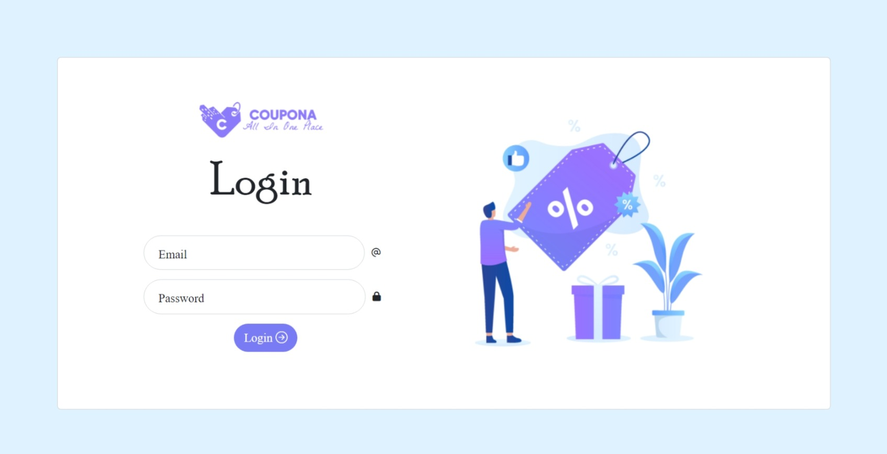
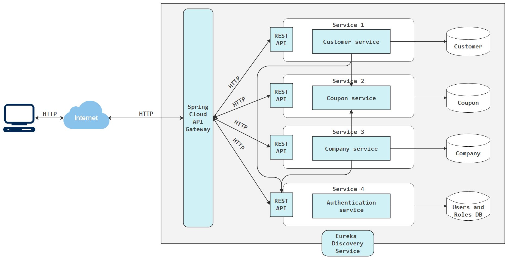
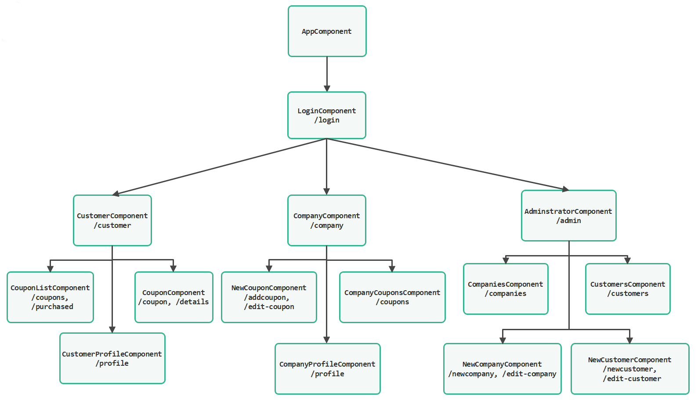

# Capstone Project Coupona:
Coupona is a "Coupon Management System", It's a web application developed using the microservices architecture, secured with the JWT and Spring Security frameworks.
One of the main goals of the application is to recommend coupons to customers. Also, they may also look for coupons using the search bar or by selecting certain categories in the sidebar.
The recommended system was developed based on the similarity between the customers, the collaborative filtering concept.
Companies are responsible for adding new coupons, while the administrator has the authority to register, edit, or delete both customers and companies in the system for efficient management.

 

# **Backend**
### **Microservices architecture**
 

 

### **Technologies:**
* Java
* Spring Boot
* Spring Data JPA
* Spring MVC
* Spring Security 
* Spring Cloud
* MySQL
* Maven

### **IDEs:**
* Eclipse

# **Frontend**
    The frontend developed with Angular in the following image is the structure of the frontend components:
 
    

 

### **Technologies:**
* Angular
* HTML
* CSS
* TypeScript

### **IDEs:**
* VS Code

